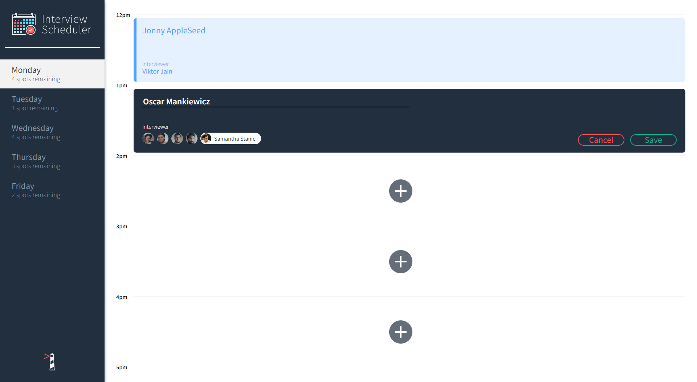
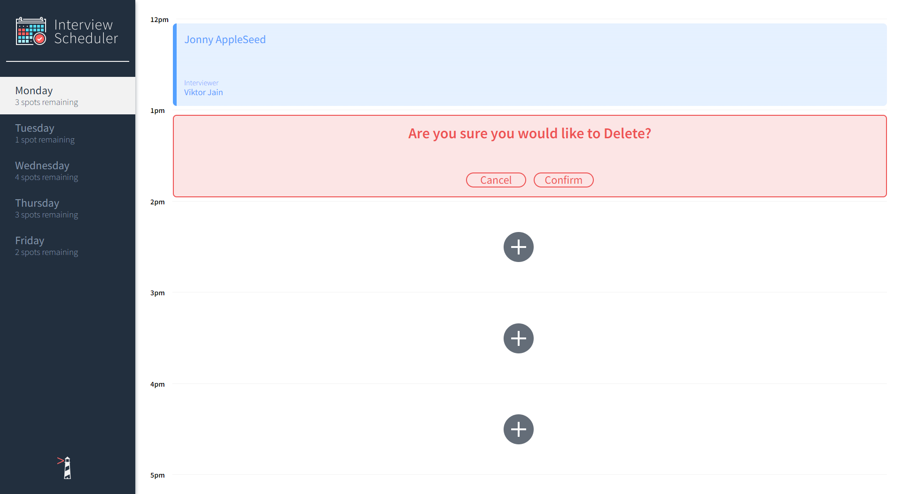
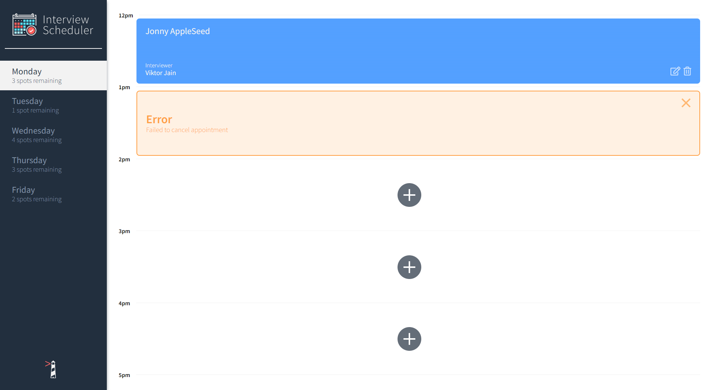

# Interview Scheduler

By: Oscar Mankiewicz

Screenshots below Setup

Link to API: https://github.com/OscarMankiewicz/scheduler-api

Please install these depenancies

axios

@testing-library/react-hooks

react-test-renderer

classnames

## Setup

Install dependencies with `npm install`.

## Running Webpack Development Server

```sh
npm start
```

## Running Jest Test Framework

```sh
npm test
```

## Running Storybook Visual Testbed

```sh
npm run storybook
```

## Screenshots
### Main Page

### Appointment Creation

### Deleting An Appointment

### One Type Of Error

